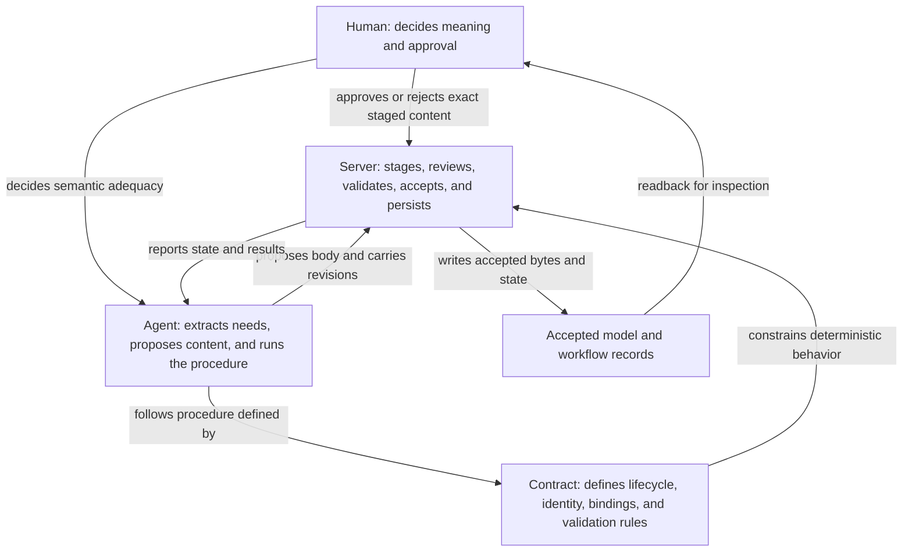
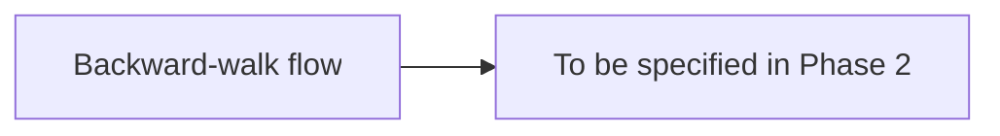
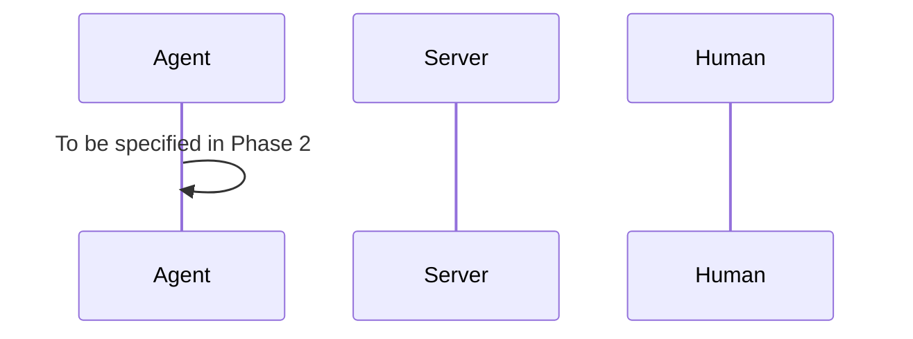
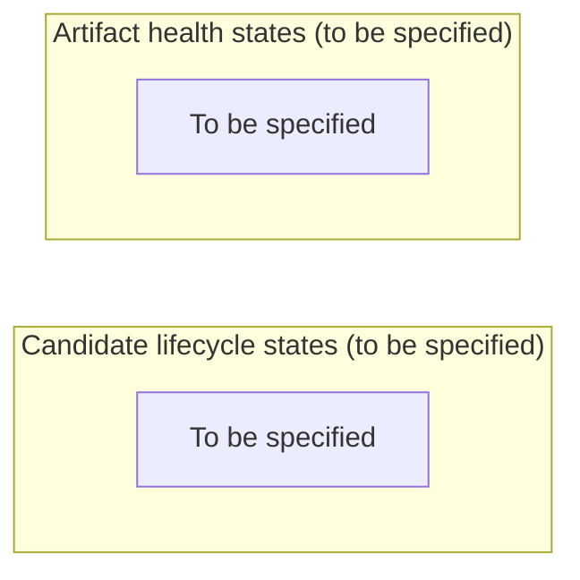

# Agent-Driven Workflow Design

## 1. Responsibility boundary

The workflow has four explicit lanes. The server performs deterministic lifecycle work, the contract defines what that work means, the agent performs semantic procedure and prepares proposals, and the human retains authority over meaning and approval. Every later change in this program must identify the lane it changes.

Baseline assumption: the contract facts in this document were verified against main at 467b6a624c9a47e3e9c9c4f36b264b8f17884674 (2026-09-25/26); confirm locally with git log -1 --format=%H.

| Lane | Responsibility | Boundary |
| --- | --- | --- |
| Server | Candidate identity, session sandboxing (`.rmwm/sessions/`), exact bytes, staging, review records, deterministic validation, acceptance, persistence, and derived state. | It does not decide domain meaning or replace human approval. |
| Contract | Artifact schemas, revision identity, source bindings, target validity, lifecycle order, dependency rules, and error classes. | It defines rules; it does not author content or perform semantic judgment. |
| Agent | Need extraction, session-scoped draft composition (`session_id`), backward-walk gap detection, semantic review, gate presentation, and rework. | It may propose and orchestrate, but in production it cannot approve or accept its own work. Test mode (D3) is the sole exception: simulated decisions are permitted only under the labeled toggle and are never equivalent to human approval. |
| Human | Decides what the system means and approves or rejects each content change in production. | Approval remains explicit even when the agent prepares all mechanics. |

### Phase boundaries

- **Informal Phase (Cascade):** Agent-driven composition using `session_id`; uses `ValidationMode::Diagnostic`; human input is advisory.
- **Formal Phase (Post-Cascade):** Server-enforced lifecycle; uses `ValidationMode::Strict`; human input is binding approval/rejection.

## 2. Decisions

**D1. Backward-walk is an agent procedure, not a server tool.** The agent must extract candidate concept needs, compare them with vocabulary, ontology, framing, and story entries, stop at the first stage without gaps, and proceed forward from the deepest gapped stage; needs extraction and adequacy are judgment, while the server remains deterministic.

**D2. The gate ritual uses one card shape with two flavors and corrected ordering.** An approach gate occurs before staging and presents a plan without server calls; a content gate occurs after `stage` and `begin review`, and the fixed sequence is stage, begin review, present the card, record the human decision, accept if approved, and report the revision.

◆ GATE — <stage>: <approach | content> approval
Context: <one line — what change this serves>
Proposed: <the plan (approach) or the minimal diff, additions only>
Question: <the single decision, in plain words>
Approve → <exact next mechanics> / Changes → <revise and re-present>
Card rules: plain English, no invented jargon, never raw tool output, never the full file, never hashes.

**D3. Test mode is a runbook toggle with labeled rationales.** Test mode still produces every full gate card, applies the default simulated approval or a scripted rejection, logs the card and decision, and prefixes each rationale with `[TEST MODE] simulated approval — no human reviewed this.`; a reviewer-identity probe determines whether the server needs a change.

**D4. Contract clarifications are decided.** Stage bodies exclude front matter because the server generates it; accepted reads include front matter; content digests cover front matter and body, so verification hashes the complete text returned by `read_staged_candidate`; revision digests include source-revision bindings; `target_revision` must equal the current accepted revision, with null or placeholders rejected; staging against a `review_required` revision is allowed for rework; revision bindings enforce stage order; reacceptance marks directly bound dependents `review_required`; candidate lifecycle and artifact health remain separate dimensions; and lifecycle-order violations have a distinct error class from content-validation failures.

**D5. The server defects to fix are bounded.** First reproduce the cryptic out-of-order `begin_candidate_review` error on current main; then fix that defect, and add reviewer identity only if the probe shows the server must distinguish stager from reviewer.

**D6. Production keeps human approval per content stage; test mode compresses the ritual.** The test toggle may simulate decisions for development runs, but it does not change the production authority boundary or make agent approval equivalent to human approval.

**D7. Work Sessions isolate informal cascading drafts from formal review gates.** Review during the cascade phase is strictly informal and diagnostic. Formal review mechanics (strict validation, approval records, and state locks) are forbidden during the cascade and occur exclusively post-cascade when a session draft is explicitly promoted to a formal staged candidate.

## 3. Diagrams

The complete responsibility boundary is repeated here so the later diagrams can be reviewed against the same lane model.

### Backward-walk flowchart

This stub will show need extraction, backward gap comparison, the stopping rule, and forward composition from the deepest gapped stage.

### Gate sequence diagram

This stub will show approach and content gates, the exact server call order, simulated test decisions, and the human decision point.

### Revised lifecycle state diagram

This intentionally non-semantic placeholder shows the candidate lifecycle and artifact health as separate tracks; no combined state machine is implied.

## 4. Change list

The sequence below is the implementation backlog for later phases. Each item names its lane and has a deliberately concise acceptance criterion because this document is a Phase 0 skeleton.

### Repository changes

1. **Phase 1, server-contract probes — server and contract lanes.** Probe digest scope, revision identity, target validity, review-required rework, stage-order errors, propagation, rejection classes, and reviewer identity.
   **Acceptance criterion:** Each verified behavior and each open behavior is recorded with a reproducible result.

2. **Phase 1, contract clarification record — contract lane.** Record the D4 contract clarifications in `docs/product_contract.md`.
   **Acceptance criterion:** Every D4 behavior stated in the design doc matches the normative contract text.

3. **Phase 1, focused server defect fix — server lane.** Reproduce and correct the cryptic out-of-order `begin_candidate_review` error on the verified baseline.
   **Acceptance criterion:** The probe demonstrates a clear lifecycle-order error and existing lifecycle tests remain passing.

4. **Phase 1, reviewer identity change if required — server and contract lanes.** Add the smallest identity representation only if the reviewer-identity probe requires it.
   **Acceptance criterion:** The probe outcome explicitly justifies either no change or the implemented identity behavior.

10. **Phase 1, Work Session Sandboxing — server and contract lanes.** Implement `session_id` on `CandidateIdentity`, preserve its optional provenance through staged candidates and views, and expose diagnostic warnings without changing candidate bytes or revision identity.
   **Acceptance criterion:** Session drafts run under `ValidationMode::Diagnostic` without creating formal review records. Formal review endpoints (`begin_candidate_review`, `record_candidate_decision`) reject session candidates and require a promoted, strictly validated candidate.

### Runbook changes

5. **Phase 2, backward-walk procedure — agent lane.** Define extraction, set comparison, stopping, delta composition, and dependent rebinding in plain English.
   **Acceptance criterion:** A reader can execute the procedure without treating it as an MCP server feature.

6. **Phase 2, gate ritual — agent and human lanes.** Define the fixed card shape, approach and content flavors, corrected ordering, rework path, and decision language.
   **Acceptance criterion:** Every content gate presents the exact card before the decision and acceptance mechanics.

7. **Phase 2, test-mode toggle — agent lane.** Add the provisional prompt block, simulated decision rules, complete card logging, and required rationale prefix.
   **Acceptance criterion:** Deleting the block restores waiting for human decisions without changing the surrounding prompts.

8. **Phase 3, test-mode dry run — agent and human lanes.** Exercise approvals and scripted rejection rework without claiming human review.
   **Acceptance criterion:** The run produces complete cards, labeled decisions, and no accepted artifact without the defined test-mode mechanics.

9. **Phase 4, human-gated run — all lanes.** Run the workflow with test mode removed and human approval retained at every content stage.
   **Acceptance criterion:** The human inspects each card and controls every approval or rejection.

## 5. Open questions

1. **Reviewer identity:** Does the server need to distinguish the person who stages a candidate from the person who reviews and approves it?

2. **Paused `r002` run:** Should the existing paused `r002` run resume from its recorded state, or should it be restarted from a clean candidate and review sequence?

3. **Execution evidence lifecycle:** What lifecycle and dependency rules should govern execution evidence, including its relationship to verification revisions and historical immutability?

4. **Genesis target:** What exact target representation is valid for the first revision when no accepted revision exists, and how should the server represent that absence without accepting placeholders?
