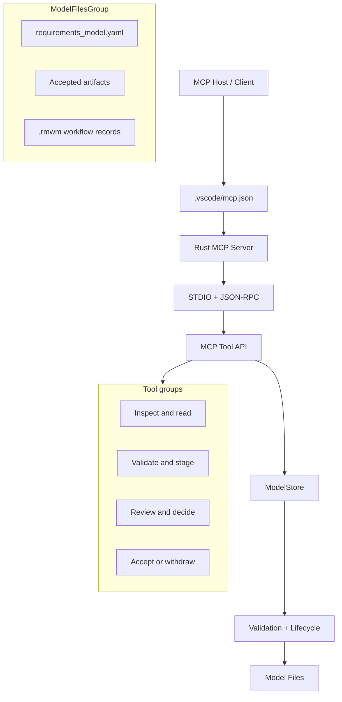
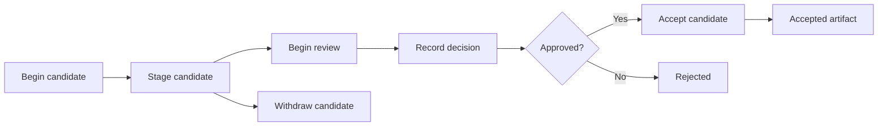

# Architecture

Requirements Model Workflow MCP is a Rust MCP server that exposes a reviewed,
revision-aware requirements model over STDIO and JSON-RPC.

## System Overview

The server reads JSON-RPC requests from standard input and writes responses to
standard output. `main.rs` handles transport and dispatch, while `ModelStore`
owns model validation, lifecycle transitions, and persistence.

The model root contains the accepted artifact files and
`requirements_model.yaml`.
The `.rmwm` directory contains staged candidates, review records,
decisions, and acceptance recovery data.

## Candidate Lifecycle

Approval and acceptance are separate operations. A candidate must be validated
against the current target and source revisions, staged as exact bytes, reviewed,
and approved before it can be accepted. Acceptance commits the exact approved
bytes and updates the manifest.

## Revision and Dependency Model

Each accepted artifact has a content digest and a revision handle. The revision
handle also records the accepted revisions of its source artifacts. When an
upstream artifact changes, dependent artifacts whose source bindings no longer
match are reported as `review_required` and must be rebound through a new
candidate.

The workflow currently covers domain framing, domain ontology, controlled
vocabulary, requirements, requirement decomposition, implementation,
verification, execution evidence, and traceability artifacts.
